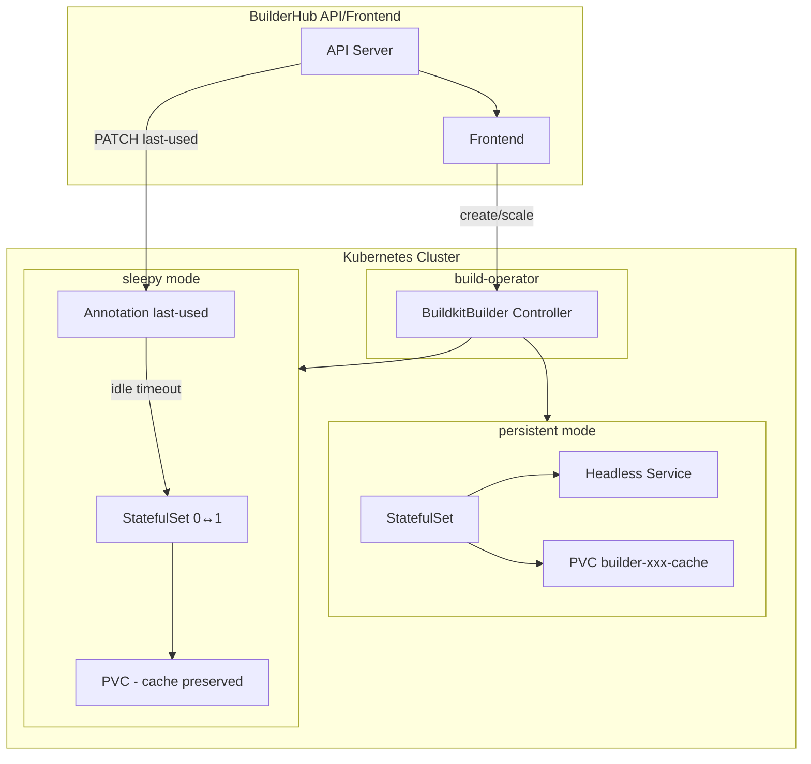

# BuilderHub BuildKit Operator

Kubernetes Operator for **BuilderHub** ([builder-hub.dev](https://builder-hub.dev)) — BuildKit as a Service on bare-metal Kubernetes. Supports persistent and sleepy builder lifecycles with zero cache loss.

## Architecture



## Builder Modes

| Mode        | Workload         | Cache                  | Use Case                                      |
|-------------|------------------|------------------------|-----------------------------------------------|
| **Persistent** | StatefulSet      | PVC (recommended)      | Long-running builders with stable identity    |
| **Sleepy**     | StatefulSet 0↔1  | PVC preserved          | Scale-to-zero with instant cache restoration  |

### Sleepy Mode (scale-to-zero)

- BuilderHub API patches `builder.builder-hub.dev/last-used` (RFC3339) when a build starts
- Controller scales StatefulSet to 0 when `now - lastUsed > idleTimeoutSeconds`
- On new build, scale to 1 → same PVC reattaches → cache instantly available

## Quick Start

```bash
# Install CRDs
make install

# Run operator locally
make run

# Deploy to cluster
make docker-build docker-push deploy
```

## Example CRs

### Template (namespace-scoped / org-scoped blueprint)

```yaml
apiVersion: builder-template.builder-hub.dev/v1alpha1
kind: BuildkitBuilderTemplate
metadata:
  name: default-template
spec:
  buildkitImage: moby/buildkit:master-rootless
  rootless: true
  arch: amd64
  cacheConfig:
    type: pvc
    pvc:
      size: "100Gi"
      accessModes: [ReadWriteOnce]
```

### Persistent

```yaml
apiVersion: builder-hub.dev/v1alpha1
kind: BuildkitBuilder
metadata:
  name: persistent-shared
  namespace: buildkit
spec:
  templateRef: my-org-template
  mode: persistent
  replicas: 1
```

### Sleepy (recommended for most cases)

```yaml
apiVersion: builder-hub.dev/v1alpha1
kind: BuildkitBuilder
metadata:
  name: sleepy-dev
  namespace: buildkit
spec:
  templateRef: my-org-template
  mode: sleepy
  replicas: 1
  idleTimeoutSeconds: 300
```

## BuilderHub Frontend Integration

- Frontend lists `BuildkitBuilder` CRs filtered by `spec.labels`
- Reads `status.endpoint` (e.g. `tcp://10.0.0.1:1234`) for BuildKit connection
- For sleepy: before starting a build, PATCH the CR to set `annotations[builder.builder-hub.dev/last-used]` to current RFC3339 timestamp
- Routes multi-arch builds by `spec.template.arch` → nodeSelector `kubernetes.io/arch`

## Requirements

- Kubernetes 1.28+
- Go 1.25 (for development)
- controller-gen (for `make generate`)

## Project Layout

```
build-operator/
├── api/v1alpha1/           # CRD types
├── cmd/main.go             # Entrypoint
├── internal/controller/    # Reconciliation logic
├── config/                 # Kustomize manifests
│   ├── crd/bases/
│   ├── rbac/
│   ├── manager/
│   └── samples/            # Example CRs
├── helm/build-operator/    # Helm chart
└── Makefile
```

## License

This project is licensed under the [MIT License](LICENSE).
